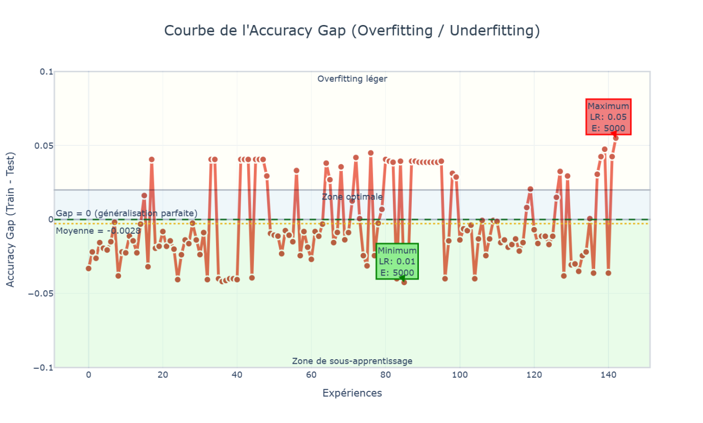
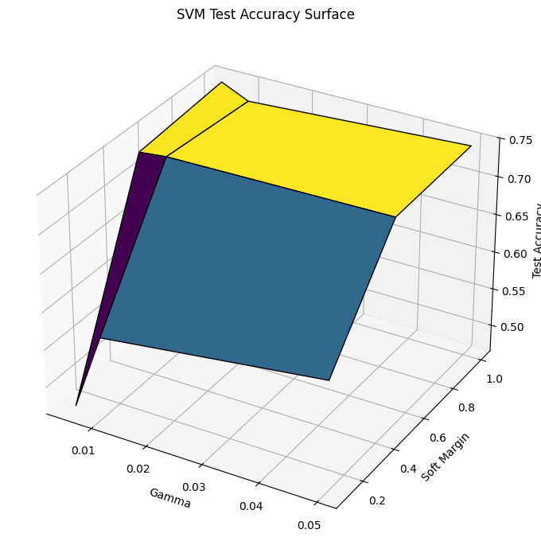
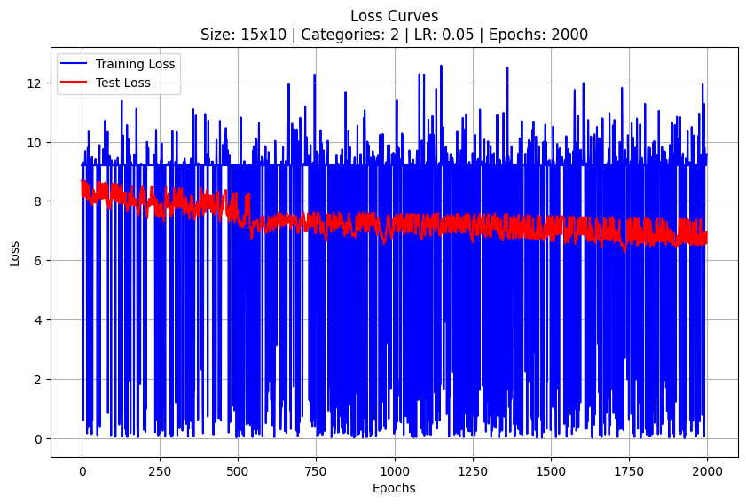
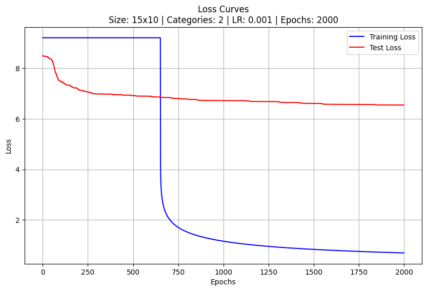
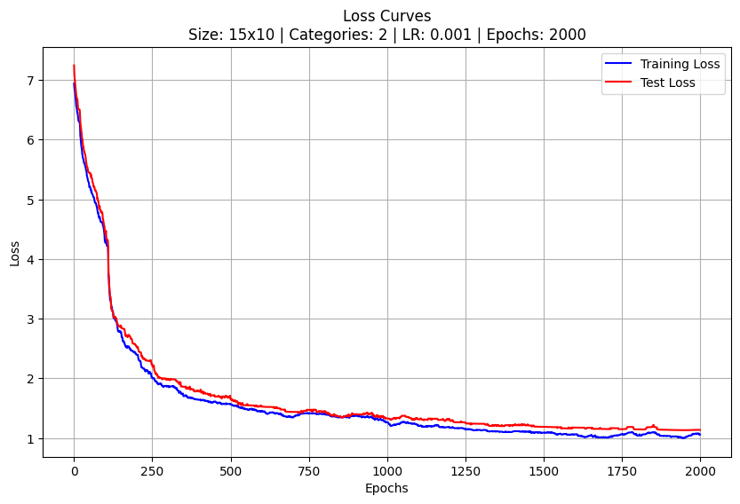
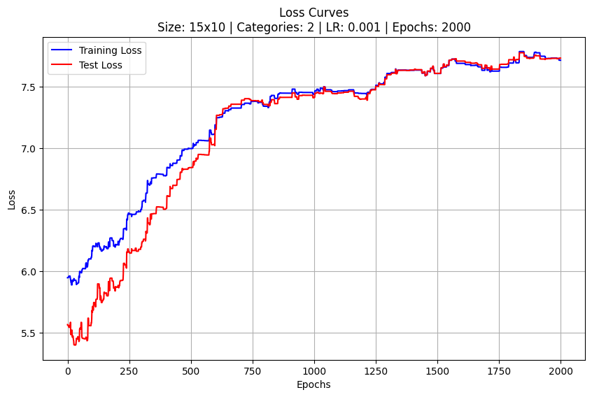
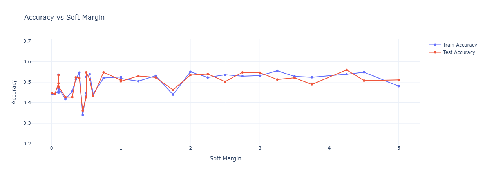
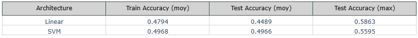
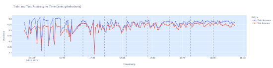

# Introduction

## Motivations

Les plateformes de streaming comme **Netflix**, **Amazon Prime** ou **Disney+** proposent une vaste bibliothèque de contenus, mais fournissent peu d’indications précises sur le **style visuel**, **l’ambiance narrative** ou **la tonalité émotionnelle** d’un film. Cette absence de clarté complique le choix des utilisateurs, qui doivent souvent se baser uniquement sur un titre ou une vignette.

Dans ce contexte, notre objectif est de développer une **intelligence artificielle embarquée dans une extension Chrome**, capable de prédire automatiquement le **genre réel** d’un film à partir de son affiche. L’enjeu est d’assister l’utilisateur dans son processus de sélection, en lui fournissant une classification pertinente, complémentaire aux informations fournies par les plateformes.

## Objectif du rapport

Ce rapport présente la démarche adoptée dans le cadre du projet, incluant :
- la description du dataset utilisé,
- les étapes de prétraitement,
- les modèles d’apprentissage développés (linéaires, SVM, MLP),
- les stratégies d’évaluation,
- ainsi que les résultats expérimentaux obtenus.

---

# Dataset

## Origine

Le dataset exploité provient de **The Movie Database (TMDB)**. Il comprend, pour chaque film :
- son **genre** (étiquette),
- et son **affiche** (image couleur).

L’ensemble a été équilibré afin de contenir **1 000 exemples par classe**, répartis sur **17 genres distincts**.

## Accès et stockage

Les données sont stockées dans une instance **MongoDB** via le système **GridFS**, conçu pour le stockage efficace de fichiers volumineux. Ce choix présente plusieurs avantages :

- **Redimensionnements pré-stockés** : les différentes tailles d’images sont conservées en base, évitant leur recalcul à chaque accès.
- **Lecture rapide** : MongoDB, même en local, offre des temps de lecture supérieurs à ceux d’un système de fichiers classique.
- **Souplesse** : l’organisation en chunks permet d’accéder à tout ou partie d’une image sans la charger intégralement.

---

# Implémentation des modèles

*La section suivante présente les différentes architectures développées pour la classification automatique des genres à partir des affiches, en détaillant les choix d’implémentation, les méthodes d’optimisation utilisées, ainsi que les résultats obtenus pour chaque type de modèle.*

## Linéaire

Modèle qui apprend par frontières linéaires. Il n’est cependant pas capable de capter les relations complexes ou non linéaires entre les pixels.

### Classification :

**Support multiclasse** : One-vs-All (chaque classe = un classifieur binaire)  

**Deux algorithmes disponibles** :
- `"gradient-descent"` : descente de gradient batch  
- `"rosenblatt"` : version stochastique (Perceptron-like)

**Initialisation des poids** :
- Soit aléatoire (`rand::random`)  
- Soit déterministe si seed fourni (`StdRng`)

### Régression :

**Méthode analytique** :  
$$w=(X^T X)^{-1} X^T y$$  
via une pseudo-inverse (Moore-Penrose)

---

## MLP

Le perceptron multi-couches (MLP) est un modèle permettant d’approximer les relations non linéaires grâce à des fonctions d’activations non linéaires (ReLu, Tanh …) mises entre les différentes couches linéaires.

**Type de modèle** : configurable via `is_classification: bool`  
- `true` → classification binaire ou multiclasse (one-hot)  
- `false` → régression

**Support multiclasse** : Oui, via une sortie à plusieurs neurones (chaque neurone = une classe, codage one-hot)  
→ Pas besoin de One-vs-All car la dernière couche a autant de neurones que de classes.

**Algorithme utilisé** :
- Stochastic Gradient Descent (SGD)
  - 1 exemple aléatoire utilisé à chaque itération

**Initialisation des poids** :
- Aléatoire uniforme dans `[-1.0, 1.0]` pour tous les poids, y compris les biais  
- Répétable via `StdRng::seed_from_u64(seed)`

### Fonctionnement détaillé

#### train (classification ou régression)

**Étape 1 – Évaluation des pertes**  
Boucle sur tous les exemples de train et de test  
Calcul par échantillon et par neurone de sortie :

- Classification : log-loss binaire  
  $$L = - y \cdot \log(\hat{y}) - (1 - y) \cdot \log(1 - \hat{y})$$
- Régression : erreur quadratique moyenne (MSE)  
  $$L = \frac{1}{2} (\hat{y} - y)^2$$

**Étape 2 – Propager un exemple**  
Propagation avant (`propagate`)
- Utilise `tanh` pour toutes les couches (y compris sortie si `is_classification`)
- Pas d’activation sur la couche de sortie si `is_classification == false` (régression)

**Étape 3 – Backpropagation**  
Sortie :  
$$
\delta_L = (\hat{y} - y) \cdot \tanh'(\hat{y}) \quad \text{(si classification)} \quad\text{ou}\quad \delta_L = \hat{y} - y \quad \text{(si régression)}
$$

Couches cachées :  
$$
\delta^l_i = \left(\sum_k \delta^{l+1}_k \cdot w^{l+1}_{ik} \right) \cdot (1 - {x^l_i}^2)
$$  
avec $$\tanh'(x) = 1 - x^2$$

**Étape 4 – Mise à jour des poids**  
Pour chaque couche \(l\), chaque neurone \(j\) et entrée \(i\) (y compris biais) :  
$$
w_{ij}^l = w_{ij}^l - \alpha \cdot x_i^{l-1} \cdot \delta_j^l
$$

---

## RBF

Un réseau à fonctions de base radiale (RBF) est un modèle qui calcule sa sortie à partir de la distance entre l’entrée et des centres (vecteurs appris ou fixés). Chaque neurone transforme cette distance via une fonction radiale (souvent une gaussienne), puis la sortie est obtenue par une combinaison pondérée de ces activations.

### Classification :

**Type de modèle** : classification  
**Support multiclasse** : One-vs-All (via `LinearModelAbstract`)  

**Transformation de l’espace d’entrée** :  
L’entrée est projetée dans un nouvel espace via une base RBF :  
$$
\phi_i(x) = \exp(-\gamma \cdot \|x - c_i\|^2)
$$  
avec \(c_i\) un centre issu du clustering (K-means++ de Lloyd)

**Deux algorithmes disponibles** :
- `"gradient-descent"` : descente de gradient batch  
- `"rosenblatt"` : apprentissage stochastique

**Initialisation des poids** :
- Aléatoire (uniforme) dans le trait `LinearModelAbstract`
- Reproductible via `StdRng::seed_from_u64`

### Régression :

**Type de modèle** : regression  
**Méthode utilisée** : résolution analytique :  
$$
w = (X^T X)^{-1} X^T y
$$  
avec \(X = \Phi(x)\), l’espace transformé (RBF)

### Fonctionnement détaillé

#### `train_classification` (multiclasse, héritée du trait)

1. **Choix des centres**  
   - K-centres fixés à l’initialisation (k)  
   - Calculés via `lloyd()` = K-means Lloyd  
   - Stockés dans `self.centers`

2. **Transformation des données**  
   Avant tout entraînement, chaque vecteur d’entrée est transformé :  
   $$
   x \rightarrow \phi(x) = \left[\exp(-\gamma \|x - c_1\|^2), ..., \exp(-\gamma \|x - c_k\|^2)\right]
   $$  
   Le test set est aussi transformé si fourni

3. **Apprentissage**  
   - La matrice \(\Phi\) remplace \(x\) dans le trait `LinearModelAbstract`  
   - On utilise les mêmes mécanismes de classification que pour un modèle linéaire :
     - Normalisation des labels
     - One-vs-All
     - Calcul des log-loss et accuracy
   - Propagation via :  
     $$
     y = \text{sigmoid}(w^T \phi(x) + b)
     $$

---

## SVM

Un SVM (Support Vector Machine) est un modèle qui cherche à tracer une frontière entre deux classes de données en maximisant la marge, c’est-à-dire la distance entre cette frontière et les points les plus proches de chaque classe (les vecteurs de support). Si les données ne sont pas séparables linéairement, le SVM utilise un noyau (kernel) pour projeter les données dans un espace de plus grande dimension, où une séparation devient possible. La décision finale se fait à partir d’une combinaison pondérée de quelques points-clés du jeu de données, les vecteurs de support.

### Fonctionnalités principales

**Entraînement (`train`)**  
**Type de modèle** :  
- SVM binaire via la struct `SVM`  
- Multiclasse via :
  - `SVMOvR` (One-vs-Rest)
  - `SVMOvO` (One-vs-One)

**Support multiclasse** :
- OvR : un classifieur binaire par classe (vs. toutes les autres)  
- OvO : un classifieur par paire de classes

**Types de noyaux supportés (`SVMKernelType`)** :
- `"Linear"` → $$K(x, x') = x^\top x'$$
- `"Polynomial(degree)"` → $$K(x, x') = (1 + x^\top x')^d$$
- `"RBF(gamma)"` → $$K(x, x') = \exp(-\gamma \|x - x'\|^2)$$

**Marges** :
- `"Hard"` : contrainte stricte $$0 \leq \alpha_i \leq \infty$$
- `"Soft(C)"` : contrainte relâchée $$0 \leq \alpha_i \leq C$$

**Résolution du problème dual** :  
Utilise le solveur quadratique OSQP

**Système de contraintes** :
- $\sum \alpha_i y_i = 0$
- $0 \leq \alpha_i \leq C$  
- Régularisation diagonale ajoutée à la matrice \(Q\) :  
  $$Q_{ii} += 1e^{-8}$$

---

### Fonctionnement détaillé

#### `train()` sur `SVM`

**Calcul de la matrice Q** :  
$$Q_{ij} = y_i y_j K(x_i, x_j)$$  
avec \(K\) choisi via `kernel_fn()`

**Construction du système (Q, q, A, l, u) pour OSQP** :
- Q : produit noyau pondéré  
- q : vecteur \(-1\)  
- A :  
  - première ligne = labels \(y_i\)  
  - puis \(I_n\) (pour \(\alpha_i\) dans \([0, C]\))  
- l, u : bornes inférieures et supérieures (selon marge dure ou souple)

**Résolution avec OSQP** :
- `eps_abs`, `eps_rel` : \(1e^{-5}\)  
- `max_iter`: 200,000

**Extraction des variables utiles** :
- \(\alpha_i\)
- vecteurs support : ceux avec \(\alpha_i > \epsilon\)
- biais :  
  $$
  b = \frac{1}{|SV|} \sum_i \left( y_i - \sum_j \alpha_j y_j K(x_j, x_i) \right)
  $$

#### `train()` sur `SVMOvR`

Pour chaque classe \(c\) :
- Création d’un SVM binaire : \(y_i = +1\) si \(y_i = c\), sinon \(-1\)
- Entraînement via `.train()`
- Résultat : `classifiers: Vec<SVM>`

#### `train()` sur `SVMOvO`

Pour chaque paire de classes \((c_i, c_j)\) :
- Extraction des exemples pertinents  
- Construction des labels \(\pm1\)  
- Entraînement d’un SVM binaire  
- Résultat : `classifiers: Vec<((i32, i32), SVM)>`

## Expérimentations et Résultats

### Méthodologie d’entrainement

#### Métriques  
Ici, on utilise l’accuracy en tant que métrique principale pour scorer les différents modèles. Simple à implémenter, et donne une idée assez précise des modèles capables. On a pas spécialement d’intérêt pour savoir à quel moment les modèles se trompent (recall et précision), ce qui fait que l’accuracy est un benchmark très simple mais suffisant dans notre cas.

#### Grid Search  
La plupart des entrainements sont faits par grid search et la détermination des hyperparamètres se fait de manière empirique. Cela permet de manipuler les modèles et tester des valeurs sans préjugés.

#### Validation  
Le dataset est mélangé aléatoirement puis séparé en 80/20.  
Pour les modèles itératifs (classifieur linéaire, MLP, RBF), la loss est sauvegardée sur le train et le test, ce qui permet de vérifier les cas de sur-apprentissage et de sous-apprentissage sur ces modèles.  
Ensuite, la métrique utilisée est l’accuracy sur le test set.  
Avec le nombre d’images de notre dataset, on n’a pas pu constituer un dataset benchmark qui ne bouge pas pour renforcer la validation.

---

### Overview des meilleurs résultats

| Modèle      | Tâche           | Test Accuracy | Algorithme / Méthode               |
|-------------|-----------------|----------------|------------------------------------|
| Linéaire    | Binaire         | 0.75           | Rosenblatt                         |
|             | 3 classes       | 0.59           | Descente de gradient               |
| MLP         | Binaire         | 0.6835         | Rétropropagation (2×16)            |
| RBF         | Binaire         | 0.79           | RBF (500 centres)                  |
|             | 3 classes       | 0.63           | RBF (500 centres)                  |
| SVM (RBF)   | Binaire         | 0.7747         | SVM kernel radial (gamma=0.05)     |
|             | 3 classes       | 0.7342         | SVM kernel radial (gamma=0.005)    |

---

### Modèle linéaire  
- Hyperparamètres : 5000 epochs, learning rate = 0.05  
- Algorithme : Rosenblatt (binaire), Descente de gradient (3 classes)  
- Test accuracy : 0.75 (binaire), 0.59 (3 classes)

### MLP  
- Hyperparamètres : architecture = [16, 16], 2000 epochs, learning rate = 0.05  
- Optimisation : grid search  
- Test accuracy : 0.6835 (binaire)

### RBF  
- Hyperparamètres : 500 centres, gamma = 0.1, epochs = 5000  
- Learning rate = 0.05 (binaire), 0.1 (3 classes)  
- Optimisation : grid search  
- Test accuracy : 0.79 (binaire), 0.63 (3 classes)

### SVM avec noyau radial  
- Hyperparamètres : C = 1.0, gamma = 0.05 (binaire), gamma = 0.005 (3 classes)  
- Optimisation : grid search  
- Test accuracy : 0.7747 (binaire), 0.7342 (3 classes)

---

## Détail des expérimentations

---
### Modèle Linéaire 

Le modèle linéaire a été évalué sur les deux cas de figure : classification binaire (['Horreur', 'Animation']) et classification tri-classe (['Horreur', 'Animation', 'Action']). L’objectif était de mesurer ses capacités de généralisation selon différents réglages d’hyperparamètres, en particulier le taux d’apprentissage (learning_rate) et le nombre d’itérations (epochs).

Résultats tri-classe
Sur l’ensemble des 16 entraînements réalisés pour la classification tri-classe, la précision moyenne sur l’ensemble d’apprentissage atteint 0.479, tandis que la précision moyenne sur l’ensemble de test s’élève à 0.449. Ces valeurs traduisent une difficulté à modéliser efficacement une séparation linéaire entre trois classes visuellement complexes, comme le sont les affiches de films.

Les meilleures performances observées sont :

Train accuracy : 0.676

Test accuracy : 0.586

pour un modèle entraîné avec 5000 epochs et un learning rate de 0.1

L’analyse montre une forte dispersion des performances (écart-type ≈ 0.11 sur la précision test), suggérant une grande sensibilité aux hyperparamètres. Les performances médianes restent modestes, ce qui souligne les limites du modèle linéaire dans des contextes à forte variabilité visuelle.

Résultats binaire
En classification binaire, le modèle linéaire affiche des performances nettement supérieures. La précision moyenne atteint 0.690 sur les données d’entraînement et 0.672 sur les données de test. Le modèle parvient donc à capturer efficacement les différences stylistiques entre deux genres, avec un écart train/test modéré.

Le meilleur modèle obtenu dans ce contexte atteint :

Train accuracy : 0.779

Test accuracy : 0.747

avec 5000 epochs et un learning rate de 0.1

Les résultats sont plus stables que dans le cas tri-classe (écart-type réduit), ce qui montre une meilleure régularité dans l’apprentissage. Les distributions quartiles confirment que les configurations intermédiaires (3000 epochs, learning rate ≈ 0.03) donnent déjà des résultats très satisfaisants, tandis que les extrêmes (taux très faibles ou très élevés) sont moins efficaces.

Conclusion
Le modèle linéaire montre des performances intéressantes en binaire, et atteint même un niveau compétitif dans certaines configurations. En revanche, ses limites apparaissent clairement dès lors que la tâche implique plus de deux classes. La qualité de séparation des données dans l’espace d’entrée n’est manifestement pas suffisante pour permettre une généralisation robuste sans ajout de non-linéarité.

---
### RBF 

Notre entrainement du RBF a été faite sur une grille très large, qui a permis d'entrainer 288 différents modèles.



Sur notre implémentation du réseau RBF, la courbe de l’Accuracy Gap montre une généralisation quasi-parfaite : la différence moyenne entre l’accuracy d’entraînement et celle de test est très proche de zéro (−0.0028). Cela signifie que notre modèle n’apprend pas trop le bruit des données d'entraînement (pas d’overfitting), tout en étant suffisamment expressif pour ne pas sous-apprendre.
La majorité des expériences restent dans la zone optimale, avec un écart très faible, ce qui confirme que notre modèle est à la fois stable et bien régularisé.


---

### SVM

Dans la continuité des expérimentations sur les modèles linéaires, plusieurs séries d’entraînements ont été menées avec des SVM à noyau, en utilisant à chaque fois une stratégie de grid search pour évaluer l’impact de deux hyperparamètres essentiels :

la marge souple (C, notée ici Soft_Margin)

le paramètre de forme du noyau (ici gamma pour le RBF)

Ces entraînements ont été réalisés sur deux scénarios : binaire (['Horreur', 'Animation']) et tri-classe (['Horreur', 'Animation', 'Action']).
Voici une des grid search utilisées: 
```python 
param_grid = {
    "Soft_Margin": [0.1, 0.5, 1],
    "gamma": [0.005, 0.01, 0.05],
    "categories": [
        ["Horreur", "Animation"],
        ["Horreur", "Animation", "Action"]
    ]
}
```


Il s'agit ici des résultats du premier batch.

D'autres batchs ont été entrainés par la suite, avec notamment des modifications au niveau d'osqp, ce qui, combiné à l'aspect aléatoire des splits peut changer légèrement les résultats.

Sur notre dernier train, les meilleurs résultats ont été obtenus avec :

| Cas                  | Soft_Margin | Gamma  | Train Accuracy | Test Accuracy | Stratégie(s)              | Image Size |
|----------------------|-------------|--------|----------------|----------------|----------------------------|-------------|
| Horreur, Animation   | 1           | 0.05   | 0.769          | 0.7747         | OneVsRest, OneVsOne        | 10x15       |
| Horreur, Animation, Action | 1     | 0.005  | 0.7811         | 0.7342         | OneVsRest, OneVsOne        | 10x15       |


Globalement, on a pu observer une bonne adéquation du noyau RBF à ces données, et une généralisation correcte (écart train/test faible). Les performances sont stables sur plusieurs combinaisons voisines, notamment pour C=0.5 ou gamma=0.01, avec une précision test proche de 0.75.

---

### MLP

#### Coût d'entraînement MLP (configuration simple)

**Config :**
- Exemples : 3000 (2400 train, 600 test)
- Architecture : 450 → 8 → 3 (1 couche cachée)
- Total poids = (450 + 1) × 8 + (8 + 1) × 3 = **3635**


#### 1. Coût par exemple (SGD)
- Forward pass : 450×8 + 8×3 = **3624 ops**
- Backpropagation : **3624 ops**
- MAJ poids : **3635 ops**
- **Total = 10883 ops/exemple**

#### 2. Coût total (SGD sur train)
- 2400 exemples × 10883 ops = **~26M ops**


#### 3. Calcul des pertes
- 1 exemple : forward + cross-entropy = 3624 + 30 = **3654 ops**
- Train loss : 2400 × 3654 = **~8.77M ops**
- Test loss : 600 × 3654 = **~2.19M ops**
- **Total pertes = ~10.96M ops**

### Bilan global par epoch

| Étape                         | Coût approx.       |
|-------------------------------|--------------------|
| Propagation + update (SGD)    | ~26 M ops          |
| Calcul train + test loss      | ~11 M ops          |
| **Total**                     | **~37 M ops/epoch** |

**Environ +30% de temps d'entraînement dû aux pertes.**

---

### Premier batch d'entraînement

Lors du premier batch, les graphiques de loss resemblaient à ca:





Il y a des soucis avec l'entraînement dans le code Rust, qui ont été corrigé par la suite.

### Batch fonctionnel


```python
param_grid = {
    'categories': [["Horreur", "Animation"], ["Horreur", "Animation", "Action"]],
    'sizes': [(15,10)],
    'hidden_layers': [[8],[16],[32],[8,8],[16,16],[32,32],[8,16,8],[450],[450,450]],
    'learning_rate': [0.001, 0.01],
    'epochs': [1000, 2000],
}
```

Meilleures performances

| Métrique         | Valeur     |
|------------------|------------|
| Train accuracy   | 0.6853     |
| Test accuracy    | 0.6582     |
| Architecture     | 32-32      |
| Learning rate    | 0.01       |
| Epochs           | 2000       |




Il apparaît que l’augmentation du nombre de couches dans l’architecture MLP ne conduit pas nécessairement à de meilleures performances. Au contraire, les modèles les plus profonds ont tendance à généraliser moins bien, avec une précision de test inférieure. De manière similaire, l’augmentation du nombre de neurones par couche ne garantit pas non plus une amélioration, et les architectures plus compactes (comme 8-8 ou 16-16) obtiennent généralement de meilleurs résultats que les modèles plus larges (32-32, 450, etc.).

Concernant le nombre d’epochs, on constate une convergence quasi systématique à 2000 epochs, avec des gains marginaux au-delà. Cela semble suffisant pour stabiliser les performances sans surcharger le temps de calcul.

Le taux d’apprentissage optimal se situe autour de 0.01, au-delà duquel des oscillations apparaissent dans la courbe de loss. Cela suggère que cette valeur constitue une borne supérieure acceptable avant que l’optimisation ne devienne instable.

En pratique, le MLP reste peu coûteux en mémoire, ce qui permet de paralléliser efficacement plusieurs entraînements en Python, notamment lors de la recherche d’hyperparamètres.

Enfin, des essais ont été menés avec un modèle plus complexe (notamment avec un grand nombre de neurones dans une seule couche). Les résultats se sont révélés décevants : la fonction de perte augmente au fil des epochs, traduisant soit un surajustement extrême, soit une mauvaise dynamique d’apprentissage. Cela confirme que augmenter la capacité du modèle sans encadrement (ex. régularisation) ne conduit pas automatiquement à de meilleures performances.



# Expérimentaions supplémentaires

## Notre lib vs scikit-learn

On a entrainé sur scikit learn directement les modèleslinéaires avec les memes hyperparamètres que notre expérimentation LinearModel

Voici les résultats 


Sur l'algorithme Rosenblatt, les meilleures performances sont les mêmes mais la dispersion est plus élevée avec notre librairie.
A l'inverse, sur la présentation du 


## Modèle linéaire: Rosenblatt vs Gradient Descent 


Les performances des deux algorithmes, Rosenblatt et Gradient Descent, sont globalement proches en termes de test accuracy, avec des résultats très similaires sur les combinaisons de genres Horreur|Animation et Horreur|Animation|Action. Dans ces conditions, le critère déterminant devient le temps d'entraînement.
Comme le montre le second graphique, Rosenblatt est nettement plus rapide, avec des durées d’entraînement bien inférieures et beaucoup plus stables. À l’inverse, la descente de gradient présente des temps plus élevés, avec une variabilité importante.
En résumé : si le temps d'exécution est une contrainte, Rosenblatt est à privilégier. La descente de gradient n’apporte qu’un gain très marginal en précision, qui ne compense pas toujours le coût en calcul


## SVM Linear vs LinearModel


On entraine ici des modèles SVM avec un noyau linéaire pour mesurer les performances avec le classifier linéaire.

On a entrainé 32 modèles, avec un C variant (seul hyperparamètre coté Python).

Voici les résultats du SVM en fonction de C



Pour des valeurs très faibles de la marge douce (soft_margin < 0.1), les performances sont instables, avec des précisions test souvent inférieures à 0.45.
→ Le classifieur est trop rigide, entraînant un sous-apprentissage.

Dans l’intervalle [0.5 ; 1.5], les performances test se stabilisent autour de 0.52 à 0.54, avec une cohérence entre les précisions entraînement et test.
→ Cela reflète un bon compromis biais/variance.

Pour des valeurs intermédiaires de soft margin (entre 2 et 3), la précision test augmente progressivement, atteignant 0.5477 à soft_margin = 2.75.
→ Le modèle commence à mieux capturer la structure des données.

Le maximum global est observé à soft_margin = 4.25 avec une précision test de 0.5595, soit la meilleure performance générale.
→ Cela indique une capacité de généralisation optimale dans ce régime de régularisation.





En train accuracy moyenne : 0.4968 pour SVM contre 0.4794 pour Linear, le SVM performe mieux.

En test accuracy moyenne : 0.4966 pour SVM contre 0.4489 pour Linear, le SVM est meilleur

En test accuracy maximale : 0.5595 pour SVM contre 0.5863 pour Linear, le modèle linéaire est meilleur.

Le SVM performe un peu moins bien que le modèle linéaire, ce qui n'est pas sensé arriver en théorie.

Cepdnant, certains paramètres peuvent expliquer ceci, par exemple le fait que le SVM dépende de la résolution d'un système quadratique par OSQP, ce qui cause des imprécisions.

En effet, avec les settings par défaut d'OSQP, le SVM dans son implémentation actuelle n'arrive pas à séparer de manière fiable des données linéairement séparables.

On a donc diminué $\epsilon$ de $10^-3$ à $10^-5$.
On aurait pu encore augmenter la précision, mais cela se fait au coût du temps de calcul pour les modèles, et ce cout est encore multiplié par 3 car il s'agit d'une classification tri-classe, avec donc 3 modèles sous-jacents à entraîner.

## Algorithme génétique pour déterminer le meilleur modèle linéaire 

Une autre contrainte rencontrée lors du projet annuel a été la détermination des meilleurs modèles. Elle se fait empiriquement, avec des allers-retours, ou alors beaucoup d'entraînements inutiles.

Pour réduire ces essais manuels, un algorithme génétique a été mis en place afin d’explorer automatiquement l’espace des hyperparamètres du modèle linéaire. L’objectif était d’identifier une configuration performante en un nombre réduit de générations, tout en maintenant une diversité suffisante dans la population initiale.

L’espace de recherche utilisé était défini ainsi :

```python

discrete_space = {
    "algo": ["gradient-descent"]
}

continuous_space = {
    "learning_rate": (0.0001, 0.1),
    "epochs": (500, 1500)
}
```



La convergence vers un modèle optimal s’est faite rapidement, avec des performances stabilisées dès la troisième génération. L’algorithme a permis d’éviter de nombreux essais inefficaces, en concentrant les ressources de calcul sur les zones prometteuses de l’espace de recherche.

Le meilleur modèle obtenu est résumé ci-dessous :

```python
best_model = {
    "model": "linear",
    "categories": ["Horreur", "Animation", "Action"],
    "size": "15x10",
    "train_accuracy": 0.5954,
    "test_accuracy": 0.5896,
    "epochs": 1461,
    "learning_rate": 0.065,
    "algo": "gradient-descent"
}
```
Ce modèle atteint les mêmes performances que celles obtenues avec les meilleurs modèles linéaires testés manuellement, tout en étant trouvé de manière automatique et reproductible. Cela montre qu’une stratégie d’optimisation bien conçue permet de retrouver efficacement les zones optimales de l’espace d’hyperparamètres, sans avoir recours à des recherches empiriques longues et peu structurées.

# Difficultés

Pendant le projet, nous avons été confrontés à plusieurs difficultés.

Tout d’abord, après avoir implémenté nos algorithmes, les premiers résultats expérimentaux étaient très décevants. Malgré plusieurs modifications dans le code, les performances restaient faibles. Ce n’est qu’après avoir pensé à normaliser les images avec minmax que nous avons observé une nette amélioration. Cette étape, pourtant simple, a eu un impact déterminant, comme le montraient nos courbes d’accuracy qui passaient soudainement de profils en "escaliers" à des courbes plus progressives et cohérentes.

Ensuite, une autre difficulté a concerné la constitution du dataset. Trouver plus de 1000 films par genre s’est révélé compliqué. Avec 17 genres à couvrir et environ 17 000 films disponibles, le volume de données par classe était vite limité. De plus, l'absence de multi-labelling nous a empêchés de réutiliser les mêmes images pour plusieurs genres, réduisant d’autant la quantité exploitable.

Enfin, lors du développement du SVM, nous avons eu des problèmes avec le solveur OSQP. Les paramètres par défaut s’avèrent trop laxistes, ce qui entraînait une perte notable de précision, sans que cela soit clairement documenté. Il a donc fallu ajuster manuellement les tolérances, ce qui demandait un équilibre délicat : des paramètres trop stricts amélioraient les résultats, mais au prix d’un temps d’entraînement très long.


